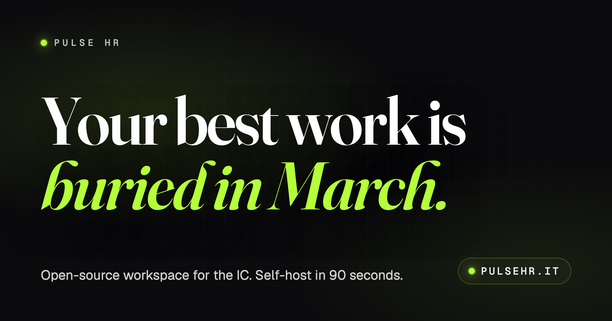
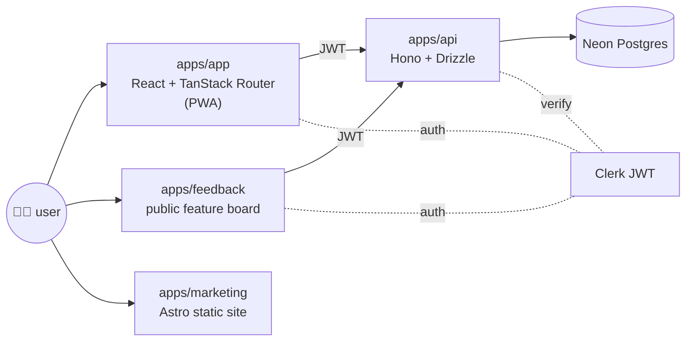

<!--
Pulse HR — README
SEO targets: open source HR, open source HRIS, self-hosted HR, modular HR,
HR software, HR API, payroll, time tracking, commessa, keyboard-first HR,
PWA HR, public roadmap, FSL-1.1-MIT.
-->

<div align="center">

<a href="https://pulsehr.it">
  
</a>

# Pulse HR

### Open-source HR, payroll and time tracking in one workspace.

**HR software for people who hate HR software.** Built in the open. Shaped by the people who use it. Money, People and Work as three composable modules — adopt one, skip the others, swap later. Self-host on your own infra, or run hosted. No sales call to see the product.

[**🚀 Live app**](https://app.pulsehr.it) · [**🌐 Marketing**](https://pulsehr.it) · [**🗺️ Roadmap**](https://pulsehr.it/roadmap) · [**📜 Changelog**](https://pulsehr.it/changelog) · [**📊 Status**](https://status.pulsehr.it) · [**💬 Feedback**](https://feedback.pulsehr.it)

[](./LICENSE)
[](https://bun.com)
[](https://tanstack.com/router)
[](https://hono.dev)
[](https://neon.tech)
[](https://pulsehr.it/roadmap)
[](./CONTRIBUTING.md)

</div>

---

## Why Pulse HR

Most HR software treats your team as rows in a CRM. Pulse treats them as people, your projects as work, and your money as money — and ships the whole thing **in public** so you can read every line of code that touches a payslip.

- 🔓 **Truly open source** — full source on GitHub under [FSL-1.1-MIT](./LICENSE). Read it, run it, fork it. Converts to plain MIT after two years.
- 🧩 **Modular by design** — **Money**, **People** and **Work** are three independent products that share one workspace, one keyboard, one API. Adopt one, skip the others.
- ⌨️ **Keyboard-first** — `⌘K` fuzzy search, `⌘J` command bar, 40+ shortcuts. Every workflow reachable without a mouse.
- 🧪 **Labs that ship** — anonymous team Pulse, commessa Forecast, peer Kudos, deep-work Focus, ⌘J Copilot. Real features, real users, in the open.
- 🪜 **Project-first time tracking** — `commessa` (project code) is a first-class concept across timesheets, forecasting, focus and saturation reporting.
- 📡 **API + webhooks on every event** — REST endpoints + webhook fan-out for proposals, comments, votes, time entries, payroll runs.
- 📱 **PWA-ready** — installs on macOS, Windows, iOS, Android. Drafts and recent views work offline, sync on reconnect.
- 🛠️ **Built on Bun** — one runtime, one package manager, no `node_modules` of `node_modules`. `bun install && bun run dev` and you're in.

> **Status — April 2026:** Pulse is in public beta. The product surface (`apps/app`) is a high-fidelity mock that runs in your browser; the **feedback board, voting power, comments and proposals** are wired to a real Hono + Postgres backend (`apps/api`) so the bits we ship next are shaped by the people using it. See the [latest changelog entry](./CHANGELOG.md) for what just landed.

---

## What's inside

### 🟣 People

Employees, roles, leave, expenses, recruiting pipeline, onboarding workflows, docs, announcements, kudos.

### 🟢 Work

Commesse (projects), timesheets, focus sessions, deep-work timer with auto-decline, forecast & burn projection with scenario sliders, saturation reporting (utilisation trend, project margins, employee value).

### 🟡 Money

Payroll runs, payslips, expense approvals, multi-country setup primitives. Built around Italian commessa accounting from day one.

### 🧪 Labs

Experimental surfaces with the [Labs visual language](apps/app/src/styles.css) (iridescent border, pulse-dot, NEW badge):

| Lab | What it does |
| --- | --- |
| **Pulse** | Anonymous vibe-check + heatmap |
| **Forecast** | Commessa burn projection with scenario sliders |
| **Kudos** | Peer coins, leaderboard, confetti |
| **Focus** | Deep-work timer with auto-decline |
| **Copilot** | Global ⌘J overlay, streaming answers, runnable actions |
| **Voting Power** | Earn, spend and refill power on the [feedback board](https://feedback.pulsehr.it) — see [v0.7.0](./CHANGELOG.md#070--2026-04-25--voting-power-with-a-real-economy) |

---

## Quick start

**Prerequisites:** [Bun](https://bun.com) ≥ 1.3. No Node required.

```bash
# 1. Clone
git clone https://github.com/davide97g/pulse-hr.git
cd pulse-hr

# 2. Install (one command, whole monorepo)
bun install

# 3. Run the app
bun run dev               # app on :5173

# Or run pieces individually:
bun run dev:app           # main product (Vite + TanStack Router)
bun run dev:api           # backend (Bun + Hono on configured port)
bun run dev:feedback      # public feature board (Vite + TanStack Router)
bun run dev:marketing     # marketing site (Astro on :4321)
```

<details>
<summary><b>More scripts</b></summary>

```bash
bun run build               # build app + api
bun run build:marketing     # build marketing site
bun run lint                # eslint (app)
bun run format              # prettier across repo
bun run db:migrate          # run API migrations against $DATABASE_URL
bun run changelog:build     # rebuild apps/api/src/data/changelog.json
```

`.env` files are auto-loaded by Bun — no `dotenv` needed. Copy any `.env.example` in `apps/*/` to `.env` before running.

</details>

---

## Repo layout

```
pulse-hr/
├── apps/
│   ├── app/         # @workflows-people/app   — main product (Vite + React 19 + TanStack Router)
│   ├── api/         # @pulse-hr/api           — Hono + Drizzle + Neon Postgres backend
│   ├── feedback/    # @pulse-hr/feedback      — public feature board (proposals, comments, votes)
│   ├── marketing/   # pulse-hr-marketing      — Astro marketing site, SEO-first
│   ├── design/      # @pulse-hr/design        — design playground
│   └── reel/        # @pulse-hr/reel          — Remotion demo videos
├── packages/
│   ├── shared/      # @pulse-hr/shared        — shared types & utils
│   ├── tokens/      # @pulse-hr/tokens        — design tokens shared across apps
│   └── ui/          # @pulse-hr/ui            — shared shadcn/ui primitives
├── docs/
│   ├── brand/       # foundation, identity, aesthetic, logo explorations
│   └── superpowers/ # design specs (e.g. voting-power v1)
└── CHANGELOG.md     # source of truth for /changelog endpoints
```

See [`CLAUDE.md`](./CLAUDE.md) for agent-facing conventions (routing, theme system, domain model, Labs patterns) and [`docs/development.md`](./docs/development.md) for the first-run guide.

---

## Architecture at a glance



- **`apps/app`** — main product surface, mostly mocked client-side. Routes are file-based (`src/routes/*.tsx`) with TanStack Router auto code-splitting; theme system supports 7 personas (`light`, `dark`, `employee`, `hr`, `admin`, `manager`, `finance`).
- **`apps/api`** — Bun + [Hono](https://hono.dev) over [Drizzle ORM](https://orm.drizzle.team) on Neon Postgres. All endpoints Clerk-authenticated. Owns comments, proposals, votes, voting power, user profiles, questionnaires, notifications, changelog.
- **`apps/feedback`** — the place real users vote on what we build next. Voting power is a real economy: 10 baseline, 1 power per vote, weekly refill, +10 grants for questionnaires and items reaching `planned`. Backend in `apps/api/src/lib/voting-power.ts`.
- **`apps/marketing`** — Astro static site, SEO-audited (sitemap, canonicals, JSON-LD `Organization` + `SoftwareApplication` + `FAQPage`, OG/Twitter cards, `llms.txt`). Optimised for AI crawlers and humans alike.

---

## Tech stack

| Layer | Choice |
| --- | --- |
| Runtime / package manager | [**Bun**](https://bun.com) (workspaces) |
| App | React 19 · Vite · TanStack Router · Tailwind 4 (CSS-first) · shadcn/ui · sonner · Recharts |
| API | Bun · [Hono](https://hono.dev) · [Drizzle ORM](https://orm.drizzle.team) · [Neon Postgres](https://neon.tech) (HTTP driver) |
| Auth | [Clerk](https://clerk.com) (JWT-verified server-side) |
| Marketing | [Astro](https://astro.build) (static, SEO-first) |
| PWA | `vite-plugin-pwa` (Workbox `generateSW`, `autoUpdate`) |
| Email | [Resend](https://resend.com) + React Email |
| Demo videos | [Remotion](https://remotion.dev) |
| Hosting | Vercel (app, feedback, marketing) · Render (api) |

---

## Project-first by design (the `commessa`)

The Italian word **commessa** (project code) is a first-class entity here, not an afterthought tacked onto a generic "project" table. It pivots Time, Forecast, Focus, Saturation reporting and Payroll allocation. If you're tracking work against client engagements, this is built for you.

---

## Roadmap & feedback

The **public roadmap** lives at [pulsehr.it/roadmap](https://pulsehr.it/roadmap). Anything you see there is open for input.

- 💡 **Feature ideas & bugs** → [feedback.pulsehr.it](https://feedback.pulsehr.it) (votes are real, voting power is earned)
- 🐛 **GitHub issues** → [github.com/davide97g/pulse-hr/issues](https://github.com/davide97g/pulse-hr/issues)
- 💬 **Discussions** → [github.com/davide97g/pulse-hr/discussions](https://github.com/davide97g/pulse-hr/discussions)
- 🔒 **Security** → [`SECURITY.md`](./SECURITY.md) — please don't open a public issue.

---

## Contributing

Contributions are welcome — this project lives in the open.

1. Read [`CONTRIBUTING.md`](./CONTRIBUTING.md) — workflow, branching, PR checklist, code style.
2. Pick something from the [open issues](https://github.com/davide97g/pulse-hr/issues) or the [public roadmap](https://pulsehr.it/roadmap).
3. Be kind. We follow the [Contributor Covenant](./CODE_OF_CONDUCT.md).

Helpful pages:

- [`docs/development.md`](./docs/development.md) — first-run guide, scripts, troubleshooting
- [`docs/self-hosting.md`](./docs/self-hosting.md) — Vercel / Docker / Kubernetes
- [`CLAUDE.md`](./CLAUDE.md) — conventions, theme tokens, domain model, Labs patterns

---

## License

[**FSL-1.1-MIT**](./LICENSE) — source-available today, **converts to MIT after two years**. See [`LICENSE`](./LICENSE) and [`NOTICE`](./NOTICE) for the full terms.

> **TL;DR:** read, fork, self-host and contribute freely; you just can't build a competing hosted Pulse HR product during the two-year window.

---

## Links

- **Product:** [app.pulsehr.it](https://app.pulsehr.it)
- **Marketing site:** [pulsehr.it](https://pulsehr.it)
- **Public roadmap:** [pulsehr.it/roadmap](https://pulsehr.it/roadmap)
- **Feature board:** [feedback.pulsehr.it](https://feedback.pulsehr.it)
- **Changelog:** [pulsehr.it/changelog](https://pulsehr.it/changelog)
- **Status:** [status.pulsehr.it](https://status.pulsehr.it)
- **LinkedIn:** [linkedin.com/company/pulse-hr-official](https://www.linkedin.com/company/pulse-hr-official)
- **X / Twitter:** [@pulsehr_it](https://x.com/pulsehr_it)
- **Email:** [hello@pulsehr.it](mailto:hello@pulsehr.it) · security: [security@pulsehr.it](mailto:security@pulsehr.it)

<div align="center">

---

<sub>Built in Milan, in public. ⚡</sub>

</div>
