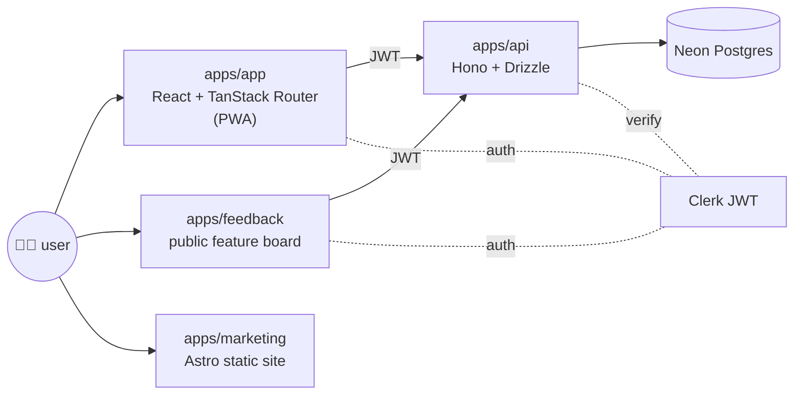

<!--
Pulse HR — README
SEO targets: employee engagement, async standup, kudos, peer recognition,
wellbeing, open source HR, self-hosted, status log, growth, employee
satisfaction, people-first HR, FSL-1.1-MIT.
-->

<div align="center">

<a href="https://pulsehr.it">
  
</a>

# Pulse HR

### Software for people, not headcount.

**The HR tool that cares how you're doing, not how many hours you logged.** Async status log, growth, kudos, wellbeing — built around the moments that matter to a team. No timesheets, no approval queues, no payroll. Open-source on GitHub, self-host or run hosted. No sales call to see the product.

[**🚀 Live app**](https://app.pulsehr.it) · [**🌐 Marketing**](https://pulsehr.it) · [**🗺️ Roadmap**](https://pulsehr.it/roadmap) · [**📜 Changelog**](https://pulsehr.it/changelog) · [**📊 Status**](https://status.pulsehr.it) · [**💬 Feedback**](https://feedback.pulsehr.it)

[](./LICENSE)
[](https://bun.com)
[](https://tanstack.com/router)
[](https://hono.dev)
[](https://neon.tech)
[](https://pulsehr.it/roadmap)
[](./CONTRIBUTING.md)

</div>

---

## Why Pulse HR

Most HR software counts people. Pulse sees them. The product covers **the people half of HR** — status, growth, kudos, wellbeing — and stays deliberately out of the business half (payroll, time tracking, project allocation, recruiting) so it does one thing well instead of ten things adequately.

- 🔓 **Truly open source** — full source on GitHub under [FSL-1.1-MIT](./LICENSE). Read it, run it, fork it. Converts to plain MIT after two years.
- 🤝 **People-first scope** — eight surfaces, all about a person, not a process. The honest list of what we *don't* ship is on [`/roadmap`](https://pulsehr.it/roadmap).
- 🔒 **Manager-safe sentiment** — raw chat and individual workload check-ins stay with the employee. Managers see aggregated trends only, and the code that enforces the boundary is in this repo.
- ⌨️ **Keyboard-first** — `⌘K` fuzzy search, `⌘J` command bar, 40+ shortcuts. Every workflow reachable without a mouse.
- 🧪 **Labs that ship** — Status Log, Workload check-in, Kudos, Moments. Real features, real users, in the open.
- 📡 **API + webhooks** — REST endpoints + webhook fan-out for the people events (kudos, status log, workload check-in, leave entries). Included on every tier.
- 📱 **PWA-ready** — installs on macOS, Windows, iOS, Android. Drafts and recent views work offline, sync on reconnect.
- 🛠️ **Built on Bun** — one runtime, one package manager, no `node_modules` of `node_modules`. `bun install && bun run dev` and you're in.

> **Status — May 2026:** Pulse just refocused on a people-first scope. The product surface (`apps/app`) is a high-fidelity mock that runs in your browser; the **feedback board, voting power, comments and proposals** are wired to a real Hono + Postgres backend (`apps/api`). See [`CHANGELOG.md`](./CHANGELOG.md) for the latest and [`wiki/AGENTS.md`](./wiki/AGENTS.md) for the active vs parked split.

---

## What's inside

Eight active surfaces, all about how a person is doing:

| Surface | What it is |
| --- | --- |
| **Status Log** | Async morning standup in writing. Three lines, public team feed, manager-safe sentiment recap. |
| **Growth** | Achievements, challenges, skill paths and kudos coins on one canvas. Continuous, not yearly. |
| **Kudos** | Peer recognition coins with reasons attached. Confetti on send. |
| **Moments** | Birthdays, work anniversaries, kudos ticker — one continuous feed. |
| **Workload check-in** | One tap a week — light / balanced / heavy / overloaded. 8-week sparkline. Manager sees the trend only. |
| **Leave journal** | Personal record of days off taken. No approvals, no pending state. |
| **Pulse** | Anonymous weekly vibe heatmap, embedded inside Status Log. |
| **People Insights** | Engagement, sentiment, kudos volume, growth trend over time. No business KPIs. |

### What we deliberately don't ship

No time tracking. No timesheet approval. No project codes. No client billing. No recruiting kanban. No onboarding workflow. No e-signature. No payroll. No turnover %. Those features make sense in some HR tool — just not this one. Pulse runs alongside the tools you already have for the business half of HR.

---

## Quick start

**Prerequisites:** [Bun](https://bun.com) ≥ 1.3. No Node required.

```bash
# 1. Clone
git clone https://github.com/davide97g/pulse-hr.git
cd pulse-hr

# 2. Install (one command, whole monorepo)
bun install

# 3. Run the app
bun run dev               # app on :5173

# Or run pieces individually:
bun run dev:app           # main product (Vite + TanStack Router)
bun run dev:api           # backend (Bun + Hono on configured port)
bun run dev:feedback      # public feature board (Vite + TanStack Router)
bun run dev:marketing     # marketing site (Astro on :4321)
```

<details>
<summary><b>More scripts</b></summary>

```bash
bun run build               # build app + api
bun run build:marketing     # build marketing site
bun run lint                # eslint (app)
bun run format              # prettier across repo
bun run db:migrate          # run API migrations against $DATABASE_URL
bun run changelog:build     # rebuild apps/api/src/data/changelog.json
```

`.env` files are auto-loaded by Bun — no `dotenv` needed. Copy any `.env.example` in `apps/*/` to `.env` before running.

</details>

---

## Repo layout

```
pulse-hr/
├── apps/
│   ├── app/         # @workflows-people/app   — main product (Vite + React 19 + TanStack Router)
│   ├── api/         # @pulse-hr/api           — Hono + Drizzle + Neon Postgres backend
│   ├── feedback/    # @pulse-hr/feedback      — public feature board (proposals, comments, votes)
│   └── marketing/   # pulse-hr-marketing      — Astro marketing site (SEO-first) + co-located studio/ content workspace (Remotion + testreel)
├── packages/
│   ├── shared/      # @pulse-hr/shared        — shared types & utils
│   ├── tokens/      # @pulse-hr/tokens        — design tokens shared across apps
│   └── ui/          # @pulse-hr/ui            — shared shadcn/ui primitives
├── docs/
│   ├── brand/       # foundation, identity, aesthetic, logo explorations
│   └── superpowers/ # design specs (e.g. voting-power v1)
└── CHANGELOG.md     # source of truth for /changelog endpoints
```

See [`CLAUDE.md`](./CLAUDE.md) for agent-facing conventions (routing, theme system, domain model, Labs patterns) and [`docs/development.md`](./docs/development.md) for the first-run guide.

---

## Architecture at a glance



- **`apps/app`** — main product surface, mostly mocked client-side. Routes are file-based (`src/routes/*.tsx`) with TanStack Router auto code-splitting; ships with `light` and `dark` themes. Sidebar is regrouped around Dashboard / You / Wellbeing / People / Workspace (May 2026 people-first refocus); parked business-ops surfaces still resolve by URL but ship off by default in the workspace modules.
- **`apps/api`** — Bun + [Hono](https://hono.dev) over [Drizzle ORM](https://orm.drizzle.team) on Neon Postgres. All endpoints Clerk-authenticated. Owns comments, proposals, votes, voting power, user profiles, questionnaires, notifications, changelog.
- **`apps/feedback`** — the place real users vote on what we build next. Voting power is a real economy: 10 baseline, 1 power per vote, weekly refill, +10 grants for questionnaires and items reaching `planned`. Backend in `apps/api/src/lib/voting-power.ts`.
- **`apps/marketing`** — Astro static site, SEO-audited (sitemap, canonicals, JSON-LD `Organization` + `SoftwareApplication` + `FAQPage`, OG/Twitter cards, `llms.txt`). Optimised for AI crawlers and humans alike.

---

## Tech stack

| Layer | Choice |
| --- | --- |
| Runtime / package manager | [**Bun**](https://bun.com) (workspaces) |
| App | React 19 · Vite · TanStack Router · Tailwind 4 (CSS-first) · shadcn/ui · sonner · Recharts |
| API | Bun · [Hono](https://hono.dev) · [Drizzle ORM](https://orm.drizzle.team) · [Neon Postgres](https://neon.tech) (HTTP driver) |
| Auth | [Clerk](https://clerk.com) (JWT-verified server-side) |
| Marketing | [Astro](https://astro.build) (static, SEO-first) |
| PWA | `vite-plugin-pwa` (Workbox `generateSW`, `autoUpdate`) |
| Email | [Resend](https://resend.com) + React Email |
| Demo videos | [Remotion](https://remotion.dev) |
| Hosting | Vercel (app, feedback, marketing) · Render (api) |

---

## People-first scope (and what changed)

Pulse HR went through a deliberate scope narrowing in **May 2026**: the surfaces about a person (Status Log, Growth, Kudos, Moments, Workload, Leave, Pulse, People Insights) stayed active and got polished; the surfaces about a business process (Time Tracking, Projects, Activities, Clients, Recruiting, Documents, Offices, Onboarding workflows, Marketplace, Developers, Calendar, Announcements) were **parked** — routes still resolve, but the modules ship off by default and the wiki marks the pages with `status: parked`.

Read [`wiki/AGENTS.md#product-focus-2026-05-refocus`](./wiki/AGENTS.md) for the active vs parked split. Read [`wiki/concepts/mission.md`](./wiki/concepts/mission.md) and [`wiki/concepts/vision.md`](./wiki/concepts/vision.md) for the why.

---

## Roadmap & feedback

The **public roadmap** lives at [pulsehr.it/roadmap](https://pulsehr.it/roadmap). Anything you see there is open for input.

- 💡 **Feature ideas & bugs** → [feedback.pulsehr.it](https://feedback.pulsehr.it) (votes are real, voting power is earned)
- 🐛 **GitHub issues** → [github.com/davide97g/pulse-hr/issues](https://github.com/davide97g/pulse-hr/issues)
- 💬 **Discussions** → [github.com/davide97g/pulse-hr/discussions](https://github.com/davide97g/pulse-hr/discussions)
- 🔒 **Security** → [`SECURITY.md`](./SECURITY.md) — please don't open a public issue.

---

## Contributing

Contributions are welcome — this project lives in the open.

1. Read [`CONTRIBUTING.md`](./CONTRIBUTING.md) — workflow, branching, PR checklist, code style.
2. Pick something from the [open issues](https://github.com/davide97g/pulse-hr/issues) or the [public roadmap](https://pulsehr.it/roadmap).
3. Be kind. We follow the [Contributor Covenant](./CODE_OF_CONDUCT.md).

Helpful pages:

- [`docs/development.md`](./docs/development.md) — first-run guide, scripts, troubleshooting
- [`docs/self-hosting.md`](./docs/self-hosting.md) — Vercel / Docker / Kubernetes
- [`CLAUDE.md`](./CLAUDE.md) — conventions, theme tokens, domain model, Labs patterns

---

## License

[**FSL-1.1-MIT**](./LICENSE) — source-available today, **converts to MIT after two years**. See [`LICENSE`](./LICENSE) and [`NOTICE`](./NOTICE) for the full terms.

> **TL;DR:** read, fork, self-host and contribute freely; you just can't build a competing hosted Pulse HR product during the two-year window.

---

## Links

- **Product:** [app.pulsehr.it](https://app.pulsehr.it)
- **Marketing site:** [pulsehr.it](https://pulsehr.it)
- **Public roadmap:** [pulsehr.it/roadmap](https://pulsehr.it/roadmap)
- **Feature board:** [feedback.pulsehr.it](https://feedback.pulsehr.it)
- **Changelog:** [pulsehr.it/changelog](https://pulsehr.it/changelog)
- **Status:** [status.pulsehr.it](https://status.pulsehr.it)
- **LinkedIn:** [linkedin.com/company/pulse-hr-official](https://www.linkedin.com/company/pulse-hr-official)
- **X / Twitter:** [@pulsehr_it](https://x.com/pulsehr_it)
- **Email:** [hello@pulsehr.it](mailto:hello@pulsehr.it) · security: [security@pulsehr.it](mailto:security@pulsehr.it)

<div align="center">

---

<sub>Built in Milan, in public. ⚡</sub>

</div>
