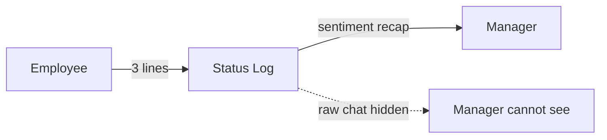

# Blog content

Drop `.mdx` files in this directory (or `it/` subdir for Italian posts). Each file becomes a route at `/blog/<slug>` (or `/it/blog/<slug>`).

## Frontmatter schema

```yaml
---
title: "How async standup works at Pulse HR"     # max 70 chars
description: "Three lines per person, public team feed, manager-safe recap..."  # 50–200 chars
datePublished: 2026-06-01
dateUpdated: 2026-06-15        # optional
author: "Davide Ghiotto"       # defaults to Davide
track: "people-first-hr"       # oss-mechanics | people-first-hr | engineering-notes | agent-native-hr
tags: ["status-log", "async"]
ogImage: ./hero.png            # optional, relative to the .mdx file
locale: "en"                   # en | it — Italian posts live under content/blog/it/
draft: false
---
```

`draft: true` excludes the post from build. Slug comes from the filename (`my-post.mdx` → `/blog/my-post`).

## Embeds

### YouTube
```mdx
import YouTube from "../../components/blog/YouTube.astro";

<YouTube
  id="dQw4w9WgXcQ"
  title="Pulse HR — async standup walkthrough"
  emitSchema={{
    description: "5-min walkthrough of the Status Log surface.",
    uploadDate: "2026-06-01",
    duration: "PT5M30S",
  }}
/>
```

Privacy-enhanced (`youtube-nocookie.com`), lazy-loaded, 16:9 aspect-ratio locked. `emitSchema` is optional; pass it to inject `VideoObject` JSON-LD.

### Excalidraw
```mdx
import Excalidraw from "../../components/blog/Excalidraw.astro";

<Excalidraw
  src="./status-log-flow.svg"
  alt="Three-step flow: write status, AI extracts sentiment, manager sees recap only."
  caption="Status Log data flow"
/>
```

SVG preferred. PNG/JPG works too — pass `width` + `height` to lock layout. Alt text is required.

### Mermaid
Just write a fenced code block. `rehype-mermaid` renders it to inline SVG at build time:

````mdx

````

For a captioned variant, wrap with the `Mermaid.astro` component.

## Dev

```bash
bun run dev:marketing
```

Posts hot-reload. Sitemap picks them up automatically on build.
